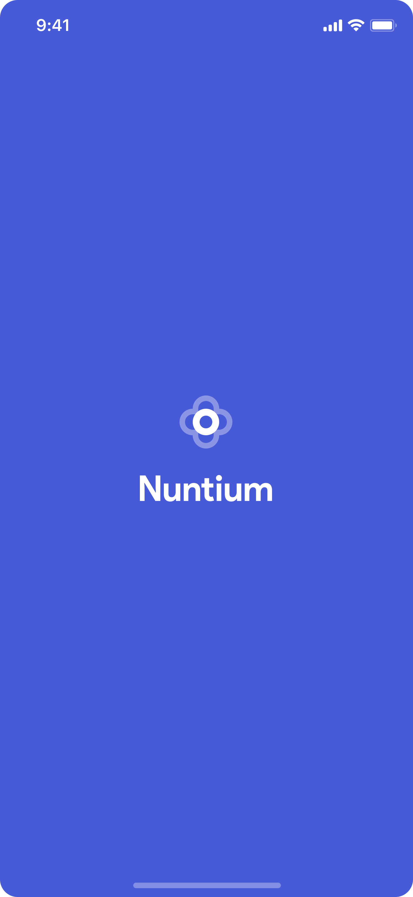
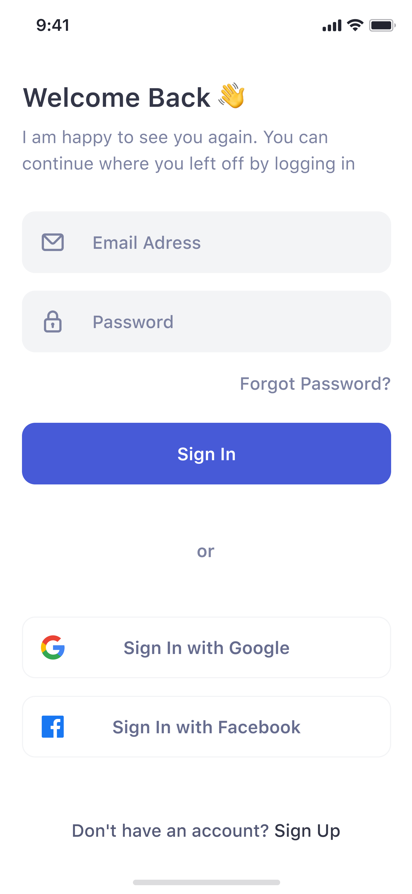
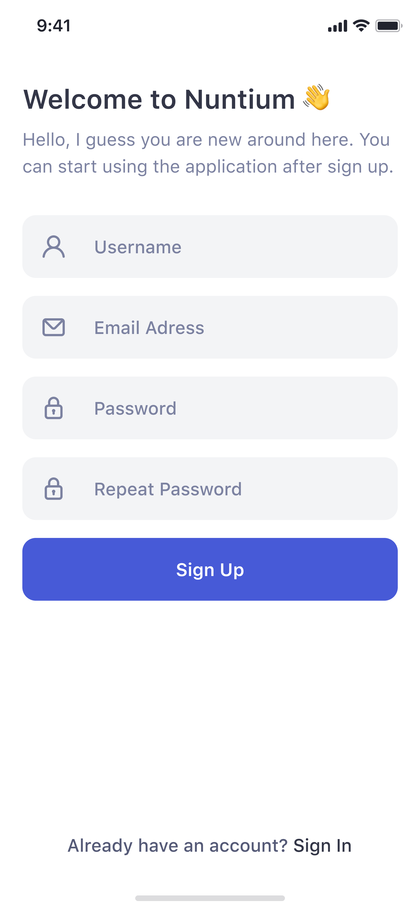
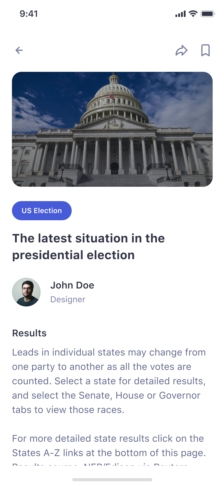
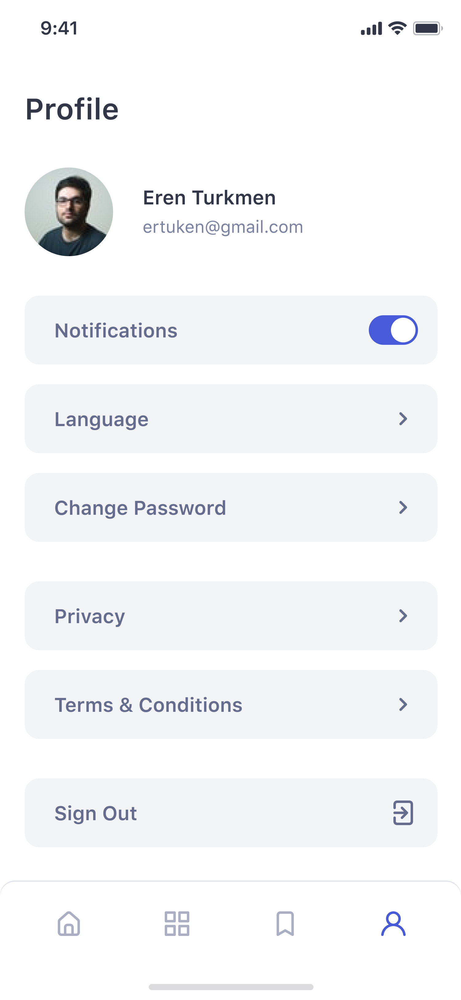
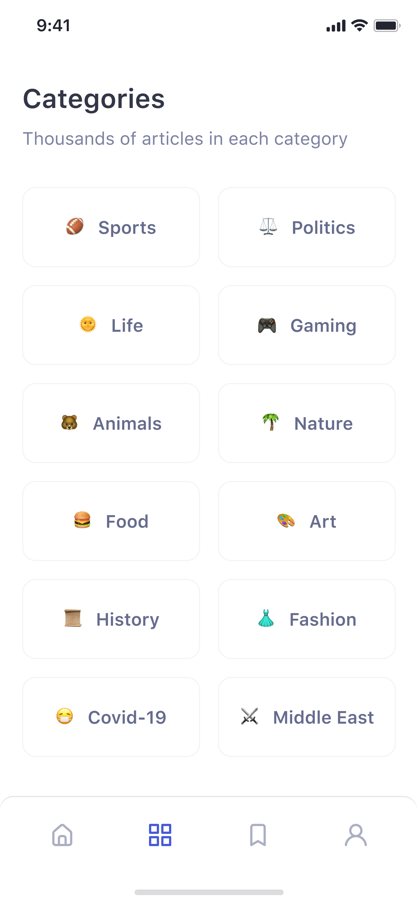

# Nuntium News App

A news app built with NEWS org API

## Inspiration

Link to Design on [Figma](https://www.figma.com/file/8E2APXR1BtxmQCxOY9Nf4Q/nuntium-news-app?node-id=26%3A84)

## Screenshots

| Splash Screen | Get Started Screen | 
|    :---:     |     :---:      |  
|    |    |

| Log In Screen | Sign Up Screen | 
|    :---:     |     :---:      |  
|    |    |

| Home Screen | Articles Screen | 
|    :---:     |     :---:      |  
|    |    |

| Profile Screen | Categories Screen  |
|    :---:     |     :---:    |
|  |    |

## Contributions

Feel free to contribute to this project.

If you find a bug or want a feature, but don't know how to fix/implement it, please fill an [issue](https://github.com/levi956/news-app/issues).
If you fixed a bug or implemented a feature, please send a [pull request](https://github.com/levi956/news-app/pulls).
